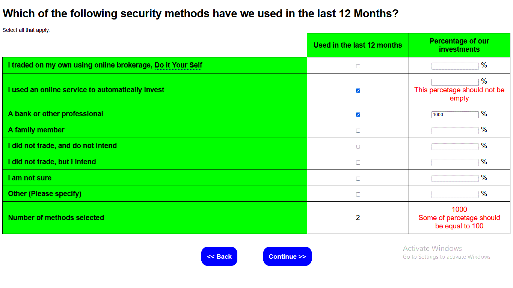
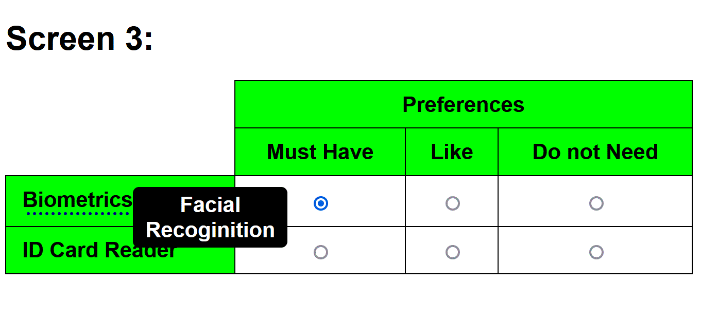
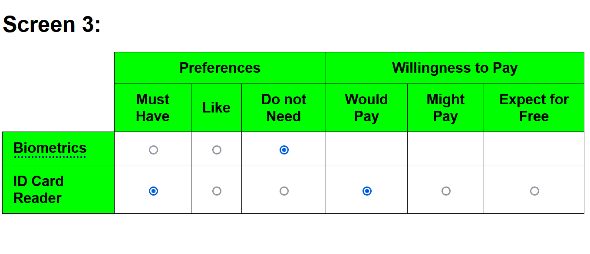

# Task 1: Screens:

This be displayed on any device, these are HTML files.  
I only used HTML, CSS and JavaScript.  

## Screen 1:

## Screen 2:

## Screen 3:

# Task 2: Python Functions:

# 1) count_words:

## Tests:

- **`*`**: Not documented in requirements, So I Had to Improvise, to handle all cases, but I can modify it if requirements change.

<table>
	<tr>
		<th>Index</th>
		<th>Test Name</th>
		<th>Inputs</th>
		<th>Output</th>
		<th>Reason</th>
	</tr>
	<tr>
		<td>1</td>
		<td>simple</td>
		<td>"You are given a string of words"</td>
		<td>[6,1,31]</td>
		<td></td>
	</tr>
	<tr>
		<td>2</td>
		<td>repeated_lower</td>
		<td>"Please write some Some unit unit tests"</td>
		<td>[4, 2, 38]</td>
		<td></td>
	</tr>
	<tr>
		<td>3</td>
		<td>repeated_upper</td>
		<td>"This This This is repeated upper"</td>
		<td>[3, 1, 32]</td>
		<td>Upper words are not unique</td>
	</tr>
	<tr>
		<td>4</td>
		<td>repeated_upper_and_lower</td>
		<td>"This this This this"</td>
		<td>[1, 1, 19]</td>
		<td></td>
	</tr>
	<tr>
		<td>5*</td>
		<td>numbers</td>
		<td>"123 4 6 87 24"</td>
		<td>[0, 0, 13]</td>
		<td>These are numbers, not lower or upper letters</td>
	</tr>
	<tr>
		<td>6</td>
		<td>empty_string</td>
		<td>""</td>
		<td>[0,0,0]</td>
		<td></td>
	</tr>
	<tr>
		<td>7</td>
		<td>arabic_letters</td>
		<td>"فيس بوك"</td>
		<td>[0, 0, 7]</td>
		<td>Arabic letters are not lower or upper</td>
	</tr>
	<tr>
		<td>8</td>
		<td>converted_to_string</td>
		<td>123</td>
		<td>[0,0,3]</td>
		<td>It has been caster to string</td>
	</tr>
</table>

# 2) make_inverted:

## Tests:
- **`*`**: Not documented in requirements, So I Had to Improvise, to handle all cases, but I can modify it if requirements change.

- **And reversed**, means that: (2,7) and (7,2) should return the same answer.  
	So they both have been tested.  
	So I am only telling one of them (2,7).  
	But I have also tested (7,2)

<table>
	<tr>
		<th>Index</th>
		<th>Test Name</th>
		<th>InputsAnd Reversed</th>
		<th>Output</th>
		<th></th>
	</tr>
	<tr>
		<td>1</td>
		<td>positive_odd</td>
		<td>2 , 7</td>
		<td>[6,5,4,3]</td>
		<td></td>
	</tr>
	<tr>
		<td>2</td>
		<td>positive_even</td>
		<td>6 , 10</td>
		<td>[10,9,8,7,6]</td>
		<td></td>
	</tr>
	<tr>
		<td>3</td>
		<td>negative_odd</td>
		<td>-2 , -7</td>
		<td>[-3,-4,-5,-6]</td>
		<td></td>
	</tr>
	<tr>
		<td>4</td>
		<td>negative_even</td>
		<td>-6 , -10</td>
		<td>[-6,-7,-8,-9,-10]</td>
		<td></td>
	</tr>
	<tr>
		<td>5</td>
		<td>positive_negative_odd</td>
		<td>-3 , 2</td>
		<td>[1,0,-1,-2]</td>
		<td></td>
	</tr>
	<tr>
		<td>6</td>
		<td>positive_negative_even</td>
		<td>-3 , 3</td>
		<td>[3,2,1,0,-1,-2,-3]</td>
		<td></td>
	</tr>
	<tr>
		<td>7</td>
		<td>equal_positive</td>
		<td>3 , 3</td>
		<td>[]</td>
		<td></td>
	</tr>
	<tr>
		<td>8</td>
		<td>equal_zero</td>
		<td>0 , 0</td>
		<td>[]</td>
		<td></td>
	</tr>
	<tr>
		<td>9</td>
		<td>equal_negative</td>
		<td>-5 , -5</td>
		<td>[]</td>
		<td></td>
	</tr>
	<tr>
		<td>10*</td>
		<td>string_integer</td>
		<td>"2" , "7"</td>
		<td>[6,5,4,3]</td>
		<td>It has been casted to integer</td>
	</tr>
	<tr>
		<td>11*</td>
		<td>string_float</td>
		<td>"2.5" , "7.6"</td>
		<td>[6,5,4,3]</td>
		<td>It has been casted to integer</td>
	</tr>
</table>

# 3) count_matched_numbers:

## Tests:
- **`*`**: Not documented in requirements, So I Had to Improvise, to handle all cases, but I can modify it if requirements change.

<table>
	<tr>
		<td>Index</td>
		<td>Test Name</td>
		<td>Inputs</td>
		<td>Output</td>
		<td>Reason</td>
	</tr>
	<tr>
		<td>1</td>
		<td>exact_match</td>
		<td>[1, 2, 3], [1, 2, 3]</td>
		<td>3</td>
		<td></td>
	</tr>
	<tr>
		<td>2</td>
		<td>partial_match</td>
		<td>[1, 2, 3], [1, 5, 3, 4, 5]</td>
		<td>2</td>
		<td></td>
	</tr>
	<tr>
		<td>3</td>
		<td>no_match</td>
		<td>[1, 2, 3], [4,5,6]</td>
		<td>False</td>
		<td>Matching Elements= 0</td>
	</tr>
	<tr>
		<td>4*</td>
		<td>first_is_empty</td>
		<td>[], [4,5,6]</td>
		<td>False</td>
		<td>Matching Elements= 0</td>
	</tr>
	<tr>
		<td>5*</td>
		<td>second_is_empty</td>
		<td>[4,5,6],[]</td>
		<td>0</td>
		<td>There are no elements in the second set</td>
	</tr>
	<tr>
		<td>6*</td>
		<td>both_empty</td>
		<td>[],[]</td>
		<td>0</td>
		<td>There are no elements in the second set</td>
	</tr>
	<tr>
		<td>7*</td>
		<td>first_not_list</td>
		<td>1,[]</td>
		<td>ERROR</td>
		<td>Integer is not iterable, expected list</td>
	</tr>
	<tr>
		<td>8*</td>
		<td>second_not_list</td>
		<td>[],1</td>
		<td>ERROR</td>
		<td>Integer is not iterable, expected list</td>
	</tr>
	<tr>
		<td>9*</td>
		<td>casted_types</td>
		<td>[1,2], ["1",2.3]</td>
		<td>2</td>
		<td>Types have been casted to the type in the first list</td>
	</tr>
</table>

# 4) check_subset:
## Tests:

- **`*`**: Not documented in requirements, So I Had to Improvise, to handle all cases, but I can modify it if requirements change.

<table>
	<tr>
		<td>Index</td>
		<td>Test_Name</td>
		<td>Inputs</td>
		<td>Output</td>
		<td>Reason</td>
	</tr>
	<tr>
		<td>1</td>
		<td>is_subset</td>
		<td>[1,2,3,4,5],[1,2,3]</td>
		<td>True</td>
		<td></td>
	</tr>
	<tr>
		<td>2</td>
		<td>empty_list_two</td>
		<td>[1,2,3,4,5],[]</td>
		<td>False</td>
		<td></td>
	</tr>
	<tr>
		<td>3</td>
		<td>mismatching_indeces</td>
		<td>[1,2,3,4,5],[1,3,6]</td>
		<td>[6]</td>
		<td></td>
	</tr>
	<tr>
		<td>4</td>
		<td>mismatching</td>
		<td>[1,2,3,4,5],[5,10]</td>
		<td>[10]</td>
		<td></td>
	</tr>
	<tr>
		<td>5*</td>
		<td>repeated</td>
		<td>[1],[1,1,1,1]</td>
		<td>[1,1,1]</td>
		<td>The nuber one is only repeated once, 
		it should be repeated 4 times.</td>
	</tr>
	<tr>
		<td>6*</td>
		<td>casted</td>
		<td>[1,2,"3"],["1",2,3]</td>
		<td>True</td>
		<td>Typoes have been casted</td>
	</tr>
	<tr>
		<td>7*</td>
		<td>both_empty</td>
		<td>[],[]</td>
		<td>True</td>
		<td>It is a subset, because both are empty</td>
	</tr>
	<tr>
		<td>8*</td>
		<td>not_list</td>
		<td>1,[]</td>
		<td>ERROR</td>
		<td>List is not iterable</td>
	</tr>
</table>

